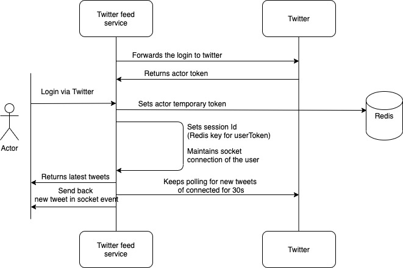

# Twitter Home Timeline

Sample webapp using react/node.js 
1. To authenticate using twitter and retrieve users home-time
2. Automatically poll and refresh for new tweets
3. Adds a new button to every tweet with three options
4. On option selection, chosen option for the tweet is stored against the user and stored

# Requires redis to maintain session

1. Start redis before starting the app in your local machine

```bash
docker run -p 6379:6379 redis -d
```

# High level architecture



# Setup Instruction

1. Run `npm install` to install the npm modules
2. Update with your twitter consumer key and secret in [constant file](lib/constants.js). Ensure the same callback url is set in twitter app settings in twitter developer portal
3. Run `npm run build` to build react components
4. Run `npm run start` to start the server
5. Hit `http://localhost:8000/api/twitter-feed-service/v0/tweets` in the browser

# Future works

1. Since this is test project twitter streams are not used as it incur cost and need account approval.

2. Polling should be replaced with another service similar to chat(Ex whatsapp) architecture where another service sends new messages in the socket

3. Since this is POC only templates for unit/integration tests are added. Coverage should be made > 90%.

# Known Issues

1. Refresh will force to login. Not a concern new tweets will be loaded at top automatically without page refresh.
2. Twitter polling API is called at 30s interval for fair usage. (Twitter Limit --> Super less :P)